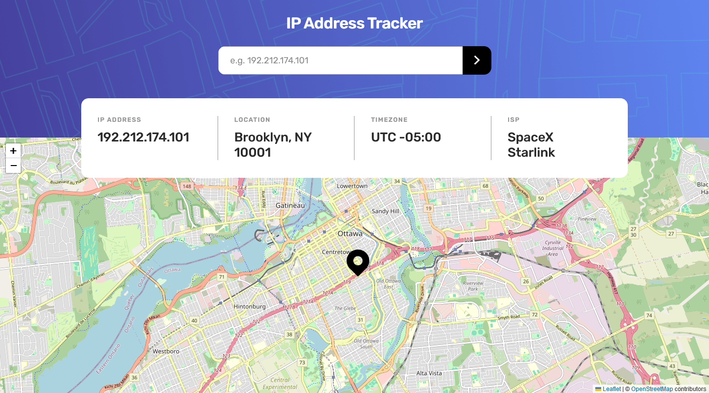

# 🚀 IP-Address-Tracker

This app was built according to the design on [Frontend Mentor](https://www.frontendmentor.io/challenges/ip-address-tracker-I8-0yYAH0/hub).

The app will take any valid ip address and return data on the IP Address, and will show the location on the map below.



# ⚡ About

I used this project to showcase my skills using ReactJS Class Components, I will work with Functional components next, but I want to be able to show off my skills in both scenarios.

The Project uses JSDoc to explain all the complicated logic to anyone that comes after and tries work on the project after me.


# 📒 Notes

1. This App was originally intended to have google maps layer over the default leaflet map style, however, due to Google not providing the API key for google maps without linking a credit card to that google account, that idea was abandoned because I dont want my credit card linked to my google account.

2. The App was built on ReactJS Class Components because the next App that is bigger is going to be made in Functional Components, and I want the ability to show off both.

# 🛑 Built on

- React 18.2.0
- leaflet: 1.9.4
- react-leaflet: 4.2.1
- node-sass: 7.0.3
- gh-pages: 6.1.1

# 💻 Development


1. clone the repository
```
git clone https://github.com/DanijelAdrinek/todo-app.git
```
2. install dependencies
```
npm install
```
3. run app
```
npm start
```